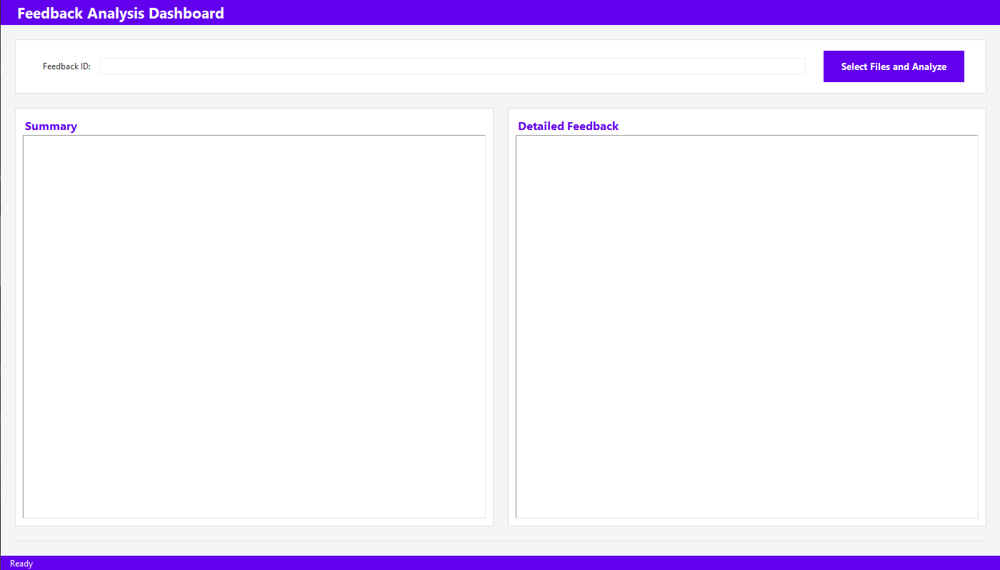
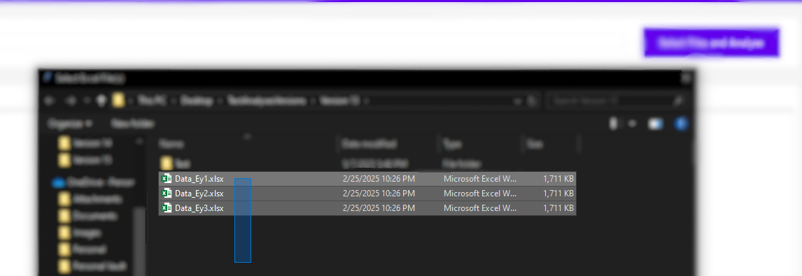
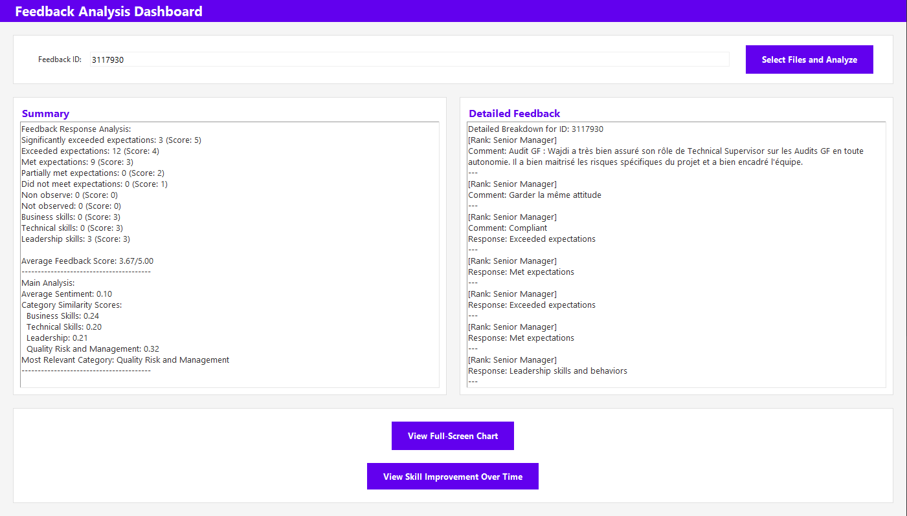
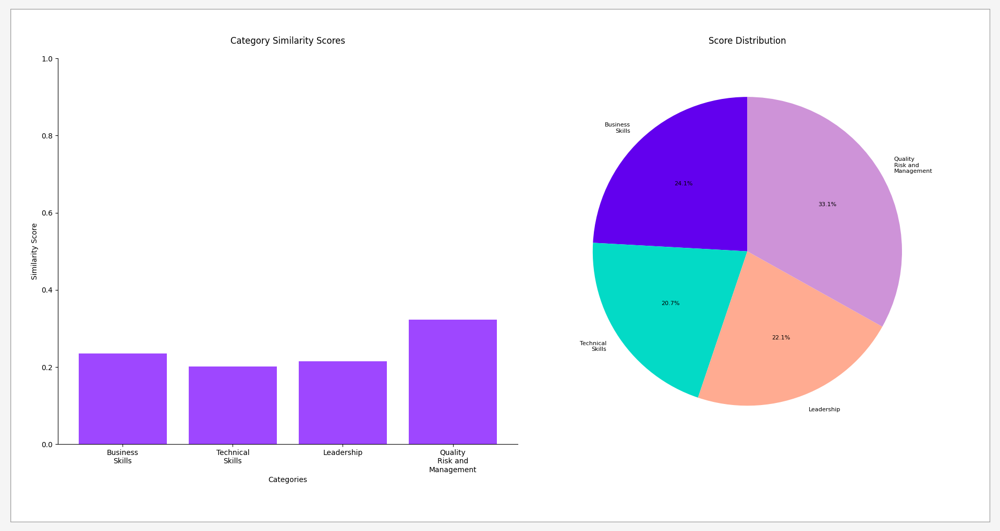
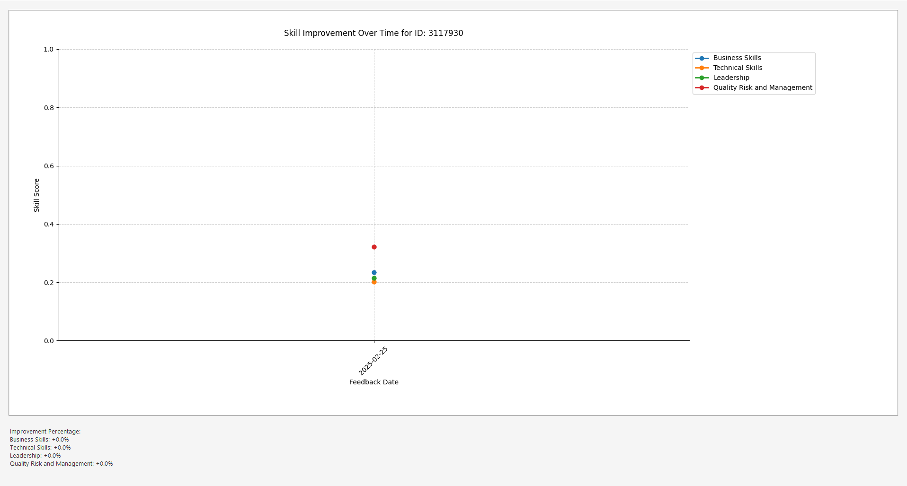

# Feedback Analysis

📊 Your intelligent feedback insights assistant

## ✨ Features

🔍 **Sentiment Analysis** - Understand emotional tone in feedback  
📈 **Category Scoring** - Automatic skill categorization  
🌍 **Multilingual Support** - Works with English/French feedback  
📅 **Multi-Period Comparison** - Track skill development over time  

## 📸 Screenshots

### Application Workflow

<div align="center">
  <table>
    <tr>
      <td></td>
      <td></td>
    </tr>
    <tr>
      <td colspan="2" align="center"><em>Main application interface and multi-file selection dialog (supports up to 3 files simultaneously)</em></td>
    </tr>
  </table>
  
  <table>
    <tr>
      <td></td>
      <td></td>
    </tr>
    <tr>
      <td colspan="2" align="center"><em>Detailed analysis results and visualization examples</em></td>
    </tr>
  </table>
  
  
  <p><em>Trend analysis comparing feedback across multiple evaluation periods</em></p>
</div>

## ⚠️ Requirements

🐍 **Python 3.8-3.12** (spaCy compatibility)  
📊 **Excel Files** (.xlsx or .csv format)  
💾 **1GB+ Free Memory** for large datasets  

## 🚀 Quick Start

```bash
# 1. Clone repository
git clone https://github.com/MohamedMeddeb/Feedback-analysis.git

# 2. Install dependencies (Python 3.8-3.12)
pip install -r requirements.txt

# 3. Run application
python feedback_analyzer.py
